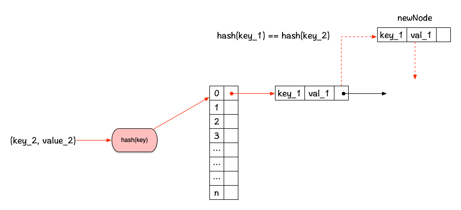
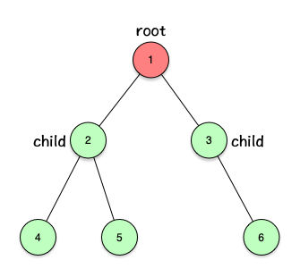
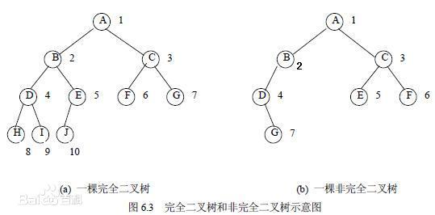
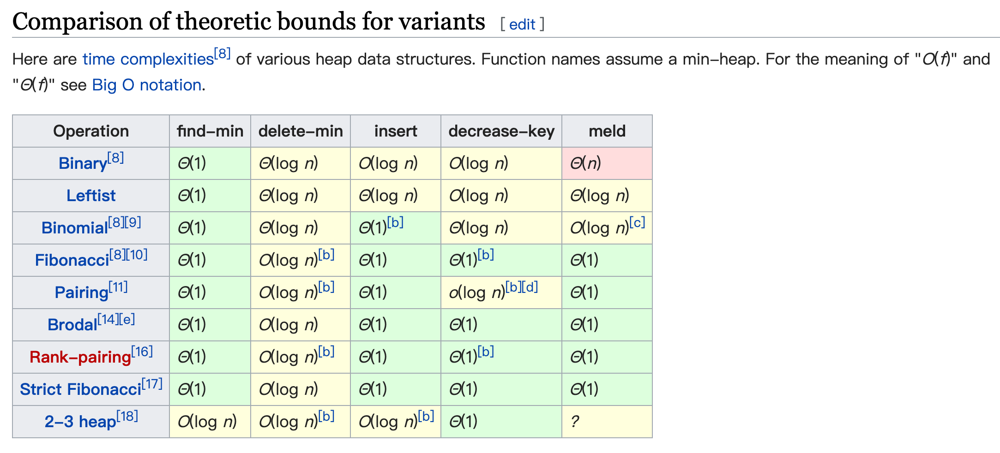
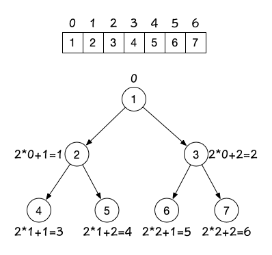
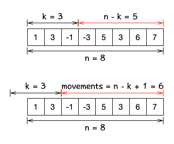
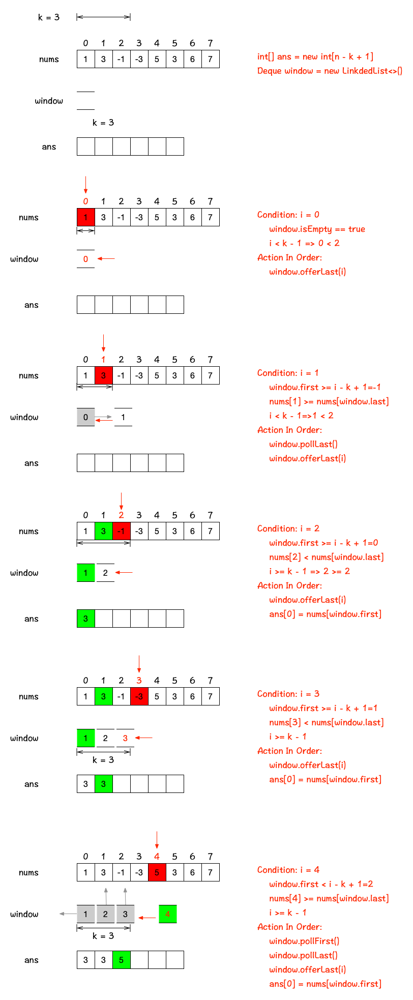

# 算法学习笔记-Week-2

## 关于哈希表及Java-HashMap源码分析

### 哈希表简介

在第5课中，讲到了哈希表这种数据结构，由于HashTable和HashSet的核心原理都一样，所以这里仅仅整理
一下哈希表这种数据结构的特点，并且分析一下Java中HashMap的源码实现，加强自己对于哈希表的理解。

首先我认为哈希表本质上是一种复合型的数据结构，因为从哈希表的实现上看，哈希表由3部分组成：

* 哈希函数：用哈希算法计算key的hash，定位元素的位置，降低各种操作的复杂度，哈希算法的精确与否
决定了哈希表发生哈希碰撞的概率，也就决定了哈希表的使用效率。
* 底层元素存储结构：其实哈希表本质上还是需要基础的数据结构来支撑，作为核心的存储结构，可以是数组，
也可以是链表，例如Java中的HashMap底层的核心存储就是用的数组，而LinkedHashMap底层就是用链表。
* bucket：之所以需要bucket，主要是为了解决[哈希碰撞问题](https://www.ruanyifeng.com/blog/2018/09/hash-collision-and-birthday-attack.html)的问题，这个bucket的数据结构可以是链表，也可以是
树，但是存在的意义是一样的。

理解了上面的3个组成部分之后，就不难想象出哈希表这种数据结构的内部机制了，这里用一张图来形象的说明
(这里为了方便起见，默认底层存储结构为数组，bucket为链表)：


关于哈希表这种数据结构这里就不再花费过多内容描述了，下面分析一下Java对于哈希表的工业级实现。

### 剖析Java-HashMap源码

HashMap相信对于Javaer们来说都不陌生，虽然日常中对于HashMap的使用可能已经烂熟于心了，但是对于
内部的实现细节，相信可能很多人都没有深究过，包括我自己也是，所以借着本次学习哈希表这种数据结构的
机会，详细理解一下。

首先从构造方法入手，看一下`HashMap`的几个主要`fields`：

```java
    /**
     * Constructs an empty <tt>HashMap</tt> with the specified initial
     * capacity and load factor.
     *
     * @param  initialCapacity the initial capacity
     * @param  loadFactor      the load factor
     * @throws IllegalArgumentException if the initial capacity is negative
     *         or the load factor is nonpositive
     */
    public HashMap(int initialCapacity, float loadFactor) {
        if (initialCapacity < 0)
            throw new IllegalArgumentException("Illegal initial capacity: " +
                                               initialCapacity);
        if (initialCapacity > MAXIMUM_CAPACITY)
            initialCapacity = MAXIMUM_CAPACITY;
        if (loadFactor <= 0 || Float.isNaN(loadFactor))
            throw new IllegalArgumentException("Illegal load factor: " +
                                               loadFactor);
        this.loadFactor = loadFactor;
        this.threshold = tableSizeFor(initialCapacity);
    }
```

这里我们看到`HashMap`在创建时可以指定两个参数，`initialCapacity`和`loadFactor`，第一个参数
其实比较好理解，就是初始的容量，而第二个参数的作用实际上在`HashMap`的[javadoc](https://docs.oracle.com/javase/10/docs/api/java/util/HashMap.html)中有说明，这里截取如下：

> The load factor is a measure of how full the hash table is allowed to get before its capacity is automatically increased. When the number of entries in the hash table exceeds the product of the load factor and the current capacity, the hash table is rehashed (that is, internal data structures are rebuilt) so that the hash table has approximately twice the number of buckets.

根据Javadoc的描述可以了解到，当哈希表存储的entries超过了 `loadFactor` * `capacity` 时，那么
底层存储元素的数组就会进行扩容操作，以提供足够的存储空间来存放未来可能添加的更多元素，在哈希表中，
这种扩容操作叫做rehash，因为当底层数组扩容之后，所有元素都需要重新计算hash值，尽量保证不和之后加入
的元素产生哈希碰撞，所以这个过程是非常耗时的操作。

了解了这两个参数的意义之后，我觉得如果后面在实际业务中创建`HashMap`对象的时候，还是尽量不要使用
`Map map = new HashMap()` 这种方式了，至少应该思考一下：在这个业务场景下，map中存储元素的上
限是多少？

下面再看一下`HashMap`底层存储元素的核心数据结构，以及bucket的结构

```java
    /**
     * The table, initialized on first use, and resized as
     * necessary. When allocated, length is always a power of two.
     * (We also tolerate length zero in some operations to allow
     * bootstrapping mechanics that are currently not needed.)
     */
    transient Node<K,V>[] table;

        /**
     * Basic hash bin node, used for most entries.  (See below for
     * TreeNode subclass, and in LinkedHashMap for its Entry subclass.)
     */
    static class Node<K,V> implements Map.Entry<K,V> {
        final int hash;
        final K key;
        V value;
        Node<K,V> next;

        Node(int hash, K key, V value, Node<K,V> next) {
            this.hash = hash;
            this.key = key;
            this.value = value;
            this.next = next;
        }

        public final K getKey()        { return key; }
        public final V getValue()      { return value; }
        public final String toString() { return key + "=" + value; }

        public final int hashCode() {
            return Objects.hashCode(key) ^ Objects.hashCode(value);
        }

        public final V setValue(V newValue) {
            V oldValue = value;
            value = newValue;
            return oldValue;
        }

        public final boolean equals(Object o) {
            if (o == this)
                return true;
            if (o instanceof Map.Entry) {
                Map.Entry<?,?> e = (Map.Entry<?,?>)o;
                if (Objects.equals(key, e.getKey()) &&
                    Objects.equals(value, e.getValue()))
                    return true;
            }
            return false;
        }
    }
```

这里可以看到，`table`这个变量实际上就是一个数组，而数组中存储的元素其实就是链表的节点，这个结构
实际上和我上面所画的图是一致的，只是`HashMap`在具体实现的时候，为了优化发生碰撞后的效率，这个
Node的结构实际上是会发生改变的，这个需要到具体的代码再进行说明。

说完`HashMap`的基本`fields`和基础结构，下面看一下常见操作的具体实现。

其实对于`HashMap`来说，最主要的操作就是存和取，也就是`put()`和`get()`,因此这里只针对这两个
操作来详细的分析，其他操作后面有时间再去详细理解。

#### get()

先上`get()`的代码

```java
    /**
     * Returns the value to which the specified key is mapped,
     * or {@code null} if this map contains no mapping for the key.
     *
     * <p>More formally, if this map contains a mapping from a key
     * {@code k} to a value {@code v} such that {@code (key==null ? k==null :
     * key.equals(k))}, then this method returns {@code v}; otherwise
     * it returns {@code null}.  (There can be at most one such mapping.)
     *
     * <p>A return value of {@code null} does not <i>necessarily</i>
     * indicate that the map contains no mapping for the key; it's also
     * possible that the map explicitly maps the key to {@code null}.
     * The {@link #containsKey containsKey} operation may be used to
     * distinguish these two cases.
     *
     * @see #put(Object, Object)
     */
    public V get(Object key) {
        Node<K,V> e;
        return (e = getNode(hash(key), key)) == null ? null : e.value;
    }

    /**
     * Implements Map.get and related methods
     *
     * @param hash hash for key
     * @param key the key
     * @return the node, or null if none
     */
    final Node<K,V> getNode(int hash, Object key) {
        Node<K,V>[] tab; Node<K,V> first, e; int n; K k;
        if ((tab = table) != null && (n = tab.length) > 0 &&
            (first = tab[(n - 1) & hash]) != null) {
            if (first.hash == hash && // always check first node
                ((k = first.key) == key || (key != null && key.equals(k))))
                return first;
            if ((e = first.next) != null) {
                if (first instanceof TreeNode)
                    return ((TreeNode<K,V>)first).getTreeNode(hash, key);
                do {
                    if (e.hash == hash &&
                        ((k = e.key) == key || (key != null && key.equals(k))))
                        return e;
                } while ((e = e.next) != null);
            }
        }
        return null;
    }
```

从代码中可以看到，主要的逻辑都集中在`getNode`方法中，而这个方法主要处理了下面两种情况：

1. 通过hash值能够直接定位唯一的元素(也就是bucket链表中只有1个元素，不存在碰撞)，那么直接返回
这个元素即可
2. bucket链表中存在多个元素，那么需要依次对比各个节点的key值，找到目标节点，然后返回元素

我这里先不讲解下面这段代码，留到put操作中去一起讲解：

```java
    if (first instanceof TreeNode)
        return ((TreeNode<K,V>)first).getTreeNode(hash, key);
```

第一种情况对应的代码如下：
```java
if (first.hash == hash && // always check first node
    ((k = first.key) == key || (key != null && key.equals(k))))
    return first;
```

这里其实做了3个比较：
1. hash值：第一个节点的hash和待查找的元素的hash值相等
2. 第一个节点的key和目标的key引用相同
3. 第一个节点的key和目标的key通过equals比较后也相同(也就是引用和值都相等)

经过这3个比较后，就能够确认这个节点就是目标节点，返回即可。

第二种情况对应的代码稍微复杂一点(删除了暂时不讲的代码)：
```java
if ((e = first.next) != null) {
    do {
        if (e.hash == hash &&
            ((k = e.key) == key || (key != null && key.equals(k))))
            return e;
    } while ((e = e.next) != null);
}
```

你会发现这里的逻辑其实和上面第一种情况的逻辑相似，就是从第二个节点开始循环去查找目标节点，这里不
再赘述。

#### put()

讲完get操作之后，我们看一下put操作，还是先上代码：

```java
    /**
     * Associates the specified value with the specified key in this map.
     * If the map previously contained a mapping for the key, the old
     * value is replaced.
     *
     * @param key key with which the specified value is to be associated
     * @param value value to be associated with the specified key
     * @return the previous value associated with <tt>key</tt>, or
     *         <tt>null</tt> if there was no mapping for <tt>key</tt>.
     *         (A <tt>null</tt> return can also indicate that the map
     *         previously associated <tt>null</tt> with <tt>key</tt>.)
     */
    public V put(K key, V value) {
        return putVal(hash(key), key, value, false, true);
    }

    /**
     * Implements Map.put and related methods
     *
     * @param hash hash for key
     * @param key the key
     * @param value the value to put
     * @param onlyIfAbsent if true, don't change existing value
     * @param evict if false, the table is in creation mode.
     * @return previous value, or null if none
     */
    final V putVal(int hash, K key, V value, boolean onlyIfAbsent,
                   boolean evict) {
        Node<K,V>[] tab; Node<K,V> p; int n, i;
        if ((tab = table) == null || (n = tab.length) == 0)
            n = (tab = resize()).length;
        if ((p = tab[i = (n - 1) & hash]) == null)
            tab[i] = newNode(hash, key, value, null);
        else {
            Node<K,V> e; K k;
            if (p.hash == hash &&
                ((k = p.key) == key || (key != null && key.equals(k))))
                e = p;
            else if (p instanceof TreeNode)
                e = ((TreeNode<K,V>)p).putTreeVal(this, tab, hash, key, value);
            else {
                for (int binCount = 0; ; ++binCount) {
                    if ((e = p.next) == null) {
                        p.next = newNode(hash, key, value, null);
                        if (binCount >= TREEIFY_THRESHOLD - 1) // -1 for 1st
                            treeifyBin(tab, hash);
                        break;
                    }
                    if (e.hash == hash &&
                        ((k = e.key) == key || (key != null && key.equals(k))))
                        break;
                    p = e;
                }
            }
            if (e != null) { // existing mapping for key
                V oldValue = e.value;
                if (!onlyIfAbsent || oldValue == null)
                    e.value = value;
                afterNodeAccess(e);
                return oldValue;
            }
        }
        ++modCount;
        if (++size > threshold)
            resize();
        afterNodeInsertion(evict);
        return null;
    }
```

这里的代码就比`get()`要复杂很多，核心的逻辑都在`putVal`这个方法中，乍一看感觉代码非常复杂，
if else 满天飞，很头疼。但是经过我仔细思考后发现，其实只需要想清楚下面的4种情况，就很容易理解
这段代码了：

1. 最常见的情况：没有hash碰撞，且目标位置之前没有元素，那么直接添加即可，画图解释如下：


2. 根据key更新value：之前已经存在的元素，根据key值更新value，图解如下：


3. 普通情况下的hash冲突：hash冲突次数不多，bucket链表长度不大的情况，需要查找到链表中正确的插入
位置，然后插入元素：



4. 特殊情况下的hash冲突：随着冲突次数增多，bucket长度持续增加，查询这个bucket下元素的效率降低，
这时需要改变bucket的存储结构来提高查询效率：


针对情况1，我们再来分解一下上面的代码，如下：

```java
if ((p = tab[i = (n - 1) & hash]) == null)
    tab[i] = newNode(hash, key, value, null);
```

就是这么简单的逻辑，这里的 `i = (n - 1) & hash` 实际上就通过取模操作找元素在map数组中对应的位置
(这里如果读过ArrayDeque的代码就很好理解)。这里其实就是第一种情况`tab[i] == null`，那么就直接
`tab[i] = newNode`。

情况2代码分解如下：
```java
if (p.hash == hash &&
    ((k = p.key) == key || (key != null && key.equals(k))))
    e = p;
// 省略部分代码
else {
    for (int binCount = 0; ; ++binCount) {
        if ((e = p.next) == null) {// 省略部分代码
        }
        if (e.hash == hash &&
            ((k = e.key) == key || (key != null && key.equals(k))))
            break;
        p = e;
    }
}
... ...
if (e != null) { // existing mapping for key
    V oldValue = e.value;
    if (!onlyIfAbsent || oldValue == null)
        e.value = value;
    afterNodeAccess(e);
    return oldValue;
}
```

上面的`afterNodeAccess`是`LinkedHashMap`提供的扩展点，这里暂时忽略。这里可以发现和`get`操作
里面查找元素的判断逻辑是一样的，都是判断目标节点的key和入参中的key是否一致，一致则证明是更新操作，
只是这里有2种情况：
1. 第一个节点就是要更新的目标节点
2. 需要从第二个节点开始查找更新的节点

因此这里就出现了两次 `if (e.hash == hash && ((k = e.key) == key || (key != null && key.equals(k))))`

由于put操作中无论是哈希碰撞，还是更新value，都需要做替换value值的操作，所以做为公共代码放在最下面。

对于情况3，如果出现了hash冲突而非更新节点，那么就要查找新的entry应该插入哪个位置，就是下面这段
代码所做的事情：
```java
for (int binCount = 0; ; ++binCount) {
    if ((e = p.next) == null) {
        p.next = newNode(hash, key, value, null);
        break;
    }
    p = e;
}
```

可以看到，删减了部分代码之后，这个逻辑就很清晰了，就是循环查找链表的结尾，然后将新的节点添加上去。

对于情况4，这里就需要补充之前get部分略过的内容了，`HashMap`中如果bucket链表的长度超过了常量值
TREEIFY_THRESHOLD，那么接下来的节点就会以红黑树的方式存储，以提升效率，相关的代码有以下几部分：

```java
// 如果要key对应的节点已经是TreeNode了，那么证明这个bucket的数据结构已经改变，则直接调用其他API
else if (p instanceof TreeNode)
    e = ((TreeNode<K,V>)p).putTreeVal(this, tab, hash, key, value);

for (int binCount = 0; ; ++binCount) {
    if ((e = p.next) == null) {
        p.next = newNode(hash, key, value, null);
        // 如果达到了TREEIFY_THRESHOLD 的值，那么就从hash值对应的节点开始改变数据结构
        if (binCount >= TREEIFY_THRESHOLD - 1) // -1 for 1st
            treeifyBin(tab, hash);
        break;
    }
}
```

上面在注释中做出了解释，至于`putTreeVal`和`treeifyBin`的逻辑这里就不展开了，是在是因为水平有限，
没看懂~~~等将来有时间再研究吧。。。。

P.S: 我发现**看懂了**跟**写出来**真的是两码事，写这个分析文档花费了多半天的时间，但看懂那一部分
代码，实际上才花费了不到半小时。。。。


## 哈希表的变通应用

在刷题过程中，发现哈希表在某些情况下可以用数组来代替以提高效率，例如242-有效字母异位词，299-猜
数字游戏，这两道题的解法中都用到了相同的思路，那就是用数组的下标作为key值，来存储一些有限的数据，
例如字母总共有26个，如果不区分大小写的话，刚好用一个长度为26的数组下标来表示；同理每位数字只能是
0~9其中一个，那就可以用一个长度为10的数组来表示，所以说数组和哈希表的区别其实就在于一个是通过index
查找元素，另一个是通过更复杂的key值查找元素。

## 242&49刷题笔记-重构题解过程

这里说一下下面的两个题目
1. [242-valid-anagram](https://leetcode-cn.com/problems/valid-anagram/description/)
2. [49-group-anagrams](https://leetcode-cn.com/problems/group-anagrams/)

这两个题目是有前后联系的，在做这两个题目的时候，我对自己的代码进行反复的重构之后，发现自顶向下的
编程方式以及可读性的重要性，下面总结一下重构的过程，以做记录。

首先看第一个题目：有效的字母异位词，这里就不对题目进行描述了，直接上官方的两种题解：

```java
public boolean isAnagram(String s, String t) {
    if (s.length() != t.length()) {
        return false;
    }
    char[] str1 = s.toCharArray();
    char[] str2 = t.toCharArray();
    Arrays.sort(str1);
    Arrays.sort(str2);
    return Arrays.equals(str1, str2);
}
```

这个题解的思路也很简单，就是先排序，再比较。

还有下面另外一种解法：

```java
public boolean isAnagram(String s, String t) {
    if (s.length() != t.length()) {
        return false;
    }
    int[] counter = new int[26];
    for (int i = 0; i < s.length(); i++) {
        counter[s.charAt(i) - 'a']++;
        counter[t.charAt(i) - 'a']--;
    }
    for (int count : counter) {
        if (count != 0) {
            return false;
        }
    }
    return true;
}
```

这种解法的思路在于用一个长度为26的数组作为哈希表，来存储每个字符出现的次数，在s中出现一次就+1，
在t中出现一次就-1，最后检查数组中是否有不为0的值。

这两种题解，我都根据自顶向下的编程思路，做出了重构，虽然核心的思路是一样的，但是我觉得这种编码
方式要更偏向于工程代码应有的样子。

下面是解法1重构后的代码：

```java
class Solution {
    public boolean isAnagram(String s, String t) {
        return resort(s).equals(resort(t));
    }

    private String resort(String s) {
        if (s == null) return "";
        if (s.length() < 2) return s;

        char[] s_arr = s.toCharArray();
        Arrays.sort(s_arr);
        return String.valueOf(s_arr);
    }
}
```

可以看到我抽取出了一个方法`resort`来对字符串进行转换，然后主逻辑用一行代码解决，这样在读起来的
时候，一眼就能知道思路，根本不需要过多的语言解释，而resort方法的实现也考虑了字符串为null或""的
情况，以及只有1个字符的情况，更重要的是，这个resort方法可以被直接复用到第49题中。

下面是解法2的重构：

```java
class Solution {
    public boolean isAnagram(String s, String t) {
        if (s == null || t == null || s.length() != t.length()) {
            return false;
        }
        
        int[] letters_cnt = countLetters(s, t, s.length());
        return checkLettersCnt(letters_cnt);
    }

    private int[] countLetters(String s, String t, int length) {
        int[] letters_cnt = new int[26];
        for (int i = 0; i < length; i++) {
            letters_cnt[s.charAt(i) - 'a'] += 1;
            letters_cnt[t.charAt(i) - 'a'] -= 1;
        }
        return letters_cnt;
    }

    private boolean checkLettersCnt(int[] letters_cnt) {
        for (int letter_count : letters_cnt) {
            if (letter_count != 0) return false;
        }
        return true;
    }
}
```

这里重构后思路也一目了然，首先是统计字母出现的次数并存储到数组中，即`countLetters`，然后检查
数组中的值是否都为0，也就是`checkLettersCnt`

下面再说一下第二个题目的解法，

```java
class Solution {
    public List<List<String>> groupAnagrams(String[] strs) {
        if (strs == null || strs.length == 0) {
            throw new IllegalArgumentException("Input list of string can't be empty!");
        }

        Map<String, List<String>> result = new HashMap<>(strs.length);
        for (String word : strs) {
            String key = resort(word);
            if (result.containsKey(key)) {
                result.get(key).add(word);
            } else {
                List<String> anagrams = new ArrayList<>();
                anagrams.add(word);
                result.put(key, anagrams);
            }
        }
        return new ArrayList<>(result.values());
    }
}
```

可以看到上面的解法依赖于之前重构出的`resort`方法，并且借住了一个hashmap来存储中间结果，这里会
发现如果没有之前重构出的`resort`方法，那么就需要自己再编写一些和之前题解重复的代码逻辑，在工程
中这样的重复代码实际上会增加维护成本，还是应该尽量避免。

## 树和二叉树知识点总结

对于树以及二叉树的相关概念和算法，是我之前的工作学习中都没有掌握的，所以这里对关键的知识点做一些
总结。

首先树的基本结构如下图：



上面是一个很简单的树结构，而树这种结构不管是在日常生活中，还是在各种工程场景中都是很常见的，也不难
理解，从图中可以看到，树都有一个根节点，这里称为root节点，其余的所有节点都是从根节点分叉出去，从
而组成一个看上去像树的结构; root节点有两个子节点(child)，每个子节点又相应的有各自的子节点，这
样层层递进下去，如果把每个子节点看做新的root节点的话，就得到了子树，实际上不难发现树的特点：

**树是一种发散型的数据结构，要定位到树中的任意节点a，必须先定位到它的父节点parent_a**

**要遍历完整个树的所有元素，必须要先遍历所有的子树，这就是一种天然的递归结构**

对于树，这里要重点掌握二叉树相关的概念以及各种不同方式的遍历方法，至于二叉树在某些算法中的复杂应用
等到后面的课程学习完之后再进行补充总结。

二叉树就是从根节点开始，每个节点最多只有两个子节点，left和right, 上面的图片就是一个二叉树的结构。

而二叉树的代码结构如下(参考leetcode）：
```java
public class TreeNode {
    int val;
    TreeNode left;
    TreeNode right;
    TreeNode(int x) { val = x; }
}
```

下面重点说一下二叉树的遍历方式：

* 前序遍历(Pre-order):  根-左-右
* 中序遍历(In-order):   左-根-右
* 后序遍历(Post-order): 左-右-根

其实这3中遍历方式的区别也很好记忆，可以固定左和右，然后看根，根在中间，就是中序，根在左边(前面)
就是前序，在右边(最后面)就是后序。

下面看一下3种遍历的代码模板，最简单的实现方式就是递归，所以这里建议首先理解递归的解题思路，然后
多写前中后序的遍历代码，有余力再研究一下非递归的遍历方式，个人感觉递归的思想是很好理解的，代码
也比较容易写，但是对于不适应这种思路的人可能觉得很难理解，所以个人感觉还是要多多练习。

### 前序遍历代码

```java
    public List<Integer> preorderTraversal(TreeNode root) {
        List<Integer> result = new ArrayList();
        helper(root, result);
        return result;
    }

    private void helper(TreeNode root, List<Integer> result) {
        if (root != null) {
            result.add(root.val);
            helper(root.left, result);
            helper(root.right, result);
        }
    }
```

### 中序代码遍历

```java
    public List<Integer> preorderTraversal(TreeNode root) {
        List<Integer> result = new ArrayList();
        helper(root, result);
        return result;
    }

    private void helper(TreeNode root, List<Integer> result) {
        if (root != null) {
            helper(root.left, result);
            result.add(root.val);
            helper(root.right, result);
        }
    }
```

### 后序代码遍历

```java
    public List<Integer> preorderTraversal(TreeNode root) {
        List<Integer> result = new ArrayList();
        helper(root, result);
        return result;
    }

    private void helper(TreeNode root, List<Integer> result) {
        if (root != null) {
            helper(root.left, result);
            helper(root.right, result);
            result.add(root.val);
        }
    }
```

这里说一下二叉搜索树以及其中序遍历，二叉搜索树的特点：对于二叉搜索树的每一个节点n，它的左子树的
所有节点的值都小于节点n的值，它的右子树的所有节点的值都大于n.val。因此二叉搜索树的中序遍历结果
是升序排列的。

## 关于堆以及堆的应用

这里拿堆的一种最简单实现来举例，先理解一下**完全二叉树**的概念

> 若设二叉树的深度为h，除第 h 层外，其它各层 (1～h-1) 的结点数都达到最大个数，第 h 层所有的结点都连续集中在最左边，这就是完全二叉树

这里引用一下网络上面的图片来对比一下完全二叉树和不完全二叉树的区别：



堆分为大顶堆和小顶堆，体现到完全二叉树上面，性质如下：

* 大顶堆：所有父节点的value都必须大于左右子节点的value
* 小顶堆：所有父节点的value都必须小于左右子节点的value

这个性质就代表对于堆来说，获取最大/最小值的时间复杂度是O(1)的，因为堆顶元素永远都是最大/最小的。

这里其实需要强调一下，堆的实现方式有很多种，最简单的一种实现是使用完全二叉树的方式，但是这种实现
方式的缺点在于插入/删除元素的复杂度都是O(logn)的，具体对比看下面的表格：



下面分析一下Java源码中对于堆的实现，即优先级队列`PriorityQueue`

### Java源码分析-PriorityQueue

Java源码提供的`PriorityQueue`底层使用平衡二叉堆的方式来实现，这里也就是上面所说的最简单的实现
方式。

下面看一下构造方法：
```java
    /**
     * Creates a {@code PriorityQueue} with the specified initial capacity
     * that orders its elements according to the specified comparator.
     *
     * @param  initialCapacity the initial capacity for this priority queue
     * @param  comparator the comparator that will be used to order this
     *         priority queue.  If {@code null}, the {@linkplain Comparable
     *         natural ordering} of the elements will be used.
     * @throws IllegalArgumentException if {@code initialCapacity} is
     *         less than 1
     */
    public PriorityQueue(int initialCapacity,
                         Comparator<? super E> comparator) {
        // Note: This restriction of at least one is not actually needed,
        // but continues for 1.5 compatibility
        if (initialCapacity < 1)
            throw new IllegalArgumentException();
        this.queue = new Object[initialCapacity];
        this.comparator = comparator;
    }
```

这里的构造方法很简单，只有两个参数，`initialCapacity`是底层数组的初始容量，`comparator`是基于
Java的内置接口`Comparator`的实现对象，这个comparator主要是用于元素的大小比较，毕竟堆需要维护
元素之间的顺序。

这里看一下`queue` field的javadoc描述：
```java
    /**
     * Priority queue represented as a balanced binary heap: the two
     * children of queue[n] are queue[2*n+1] and queue[2*(n+1)].  The
     * priority queue is ordered by comparator, or by the elements'
     * natural ordering, if comparator is null: For each node n in the
     * heap and each descendant d of n, n <= d.  The element with the
     * lowest value is in queue[0], assuming the queue is nonempty.
     */
    transient Object[] queue; // non-private to simplify nested class access
```

从描述中其实也可以确定，`PriorityQueue`代表一个平衡二叉堆(Balanced binary heap)，由于地层
使用数组来模拟树的结构，那么如何确定子节点的位置呢，这里也给出了描述：`the two children of queue[n are queue[2*n+1] and queue[2*(n+1)]`

这里根据描述画图解释一下：



由于堆这种数据结构的最重要的特点就是堆顶元素一定是所有元素中的最大值或最小值，所以这里主要关注
`PriorityQueue`在添加/删除元素的过程中，如何确保证堆的这一特性，因此下面重点看一下`offer`和
`poll`这两个方法的实现：

下面看一下`offer`的源码：
```java
    /**
     * Inserts the specified element into this priority queue.
     *
     * @return {@code true} (as specified by {@link Queue#offer})
     * @throws ClassCastException if the specified element cannot be
     *         compared with elements currently in this priority queue
     *         according to the priority queue's ordering
     * @throws NullPointerException if the specified element is null
     */
    public boolean offer(E e) {
        if (e == null)
            throw new NullPointerException();
        modCount++;
        int i = size;
        if (i >= queue.length)
            grow(i + 1);
        size = i + 1;
        if (i == 0)
            queue[0] = e;
        else
            siftUp(i, e);
        return true;
    }
```

从上面的实现可以看出，其实逻辑很简单，就是简单的在添加元素的时候，将新元素的index设置为数组的size,
也就是从逻辑上将其放到数组的末尾，如果数组空间不够就对数组进行扩容，但是区别于普通的添加，这里多
出了一个`siftUp`的操作，而这个操作恰好是如何保证堆元素顺序的关键，下面看一下`siftUp`的代码

```java
    /**
     * Inserts item x at position k, maintaining heap invariant by
     * promoting x up the tree until it is greater than or equal to
     * its parent, or is the root.
     *
     * To simplify and speed up coercions and comparisons. the
     * Comparable and Comparator versions are separated into different
     * methods that are otherwise identical. (Similarly for siftDown.)
     *
     * @param k the position to fill
     * @param x the item to insert
     */
    private void siftUp(int k, E x) {
        if (comparator != null)
            siftUpUsingComparator(k, x);
        else
            siftUpComparable(k, x);
    }

    @SuppressWarnings("unchecked")
    private void siftUpComparable(int k, E x) {
        Comparable<? super E> key = (Comparable<? super E>) x;
        while (k > 0) {
            int parent = (k - 1) >>> 1;
            Object e = queue[parent];
            if (key.compareTo((E) e) >= 0)
                break;
            queue[k] = e;
            k = parent;
        }
        queue[k] = key;
    }

    @SuppressWarnings("unchecked")
    private void siftUpUsingComparator(int k, E x) {
        while (k > 0) {
            int parent = (k - 1) >>> 1;
            Object e = queue[parent];
            if (comparator.compare(x, (E) e) >= 0)
                break;
            queue[k] = e;
            k = parent;
        }
        queue[k] = x;
    }
```

从上面的逻辑可以看到，siftUp首先判断是否在构造方法中提供了`comparator`，如果没有则用元素本身
实现的`Comparable`接口来进行比较，不论是哪种情况，逻辑上都是基本一致的，只是比较元素大小的方式
不同而已。

我们主要看用Comparator比较的情况，入参有两个：
* 待插入的元素`E x`
* 待插入元素的index `int k`

要理解循环体while里面的逻辑，我们回过头来想一下在`offer`方法里，只是简单的把待插入的index设置
为`size`，因此这里传入的元素下标`k`初始值其实是`size`，也就是数组最后一个元素的位置。

因此这里我们思考一下，虽然从逻辑上已经将待插入的元素放到了数组的末尾，但是实际上元素`x`的值不一定
比他的父节点(parent)的值要小，因此这里while循环所做的事情就是找到元素`x`应该在的位置，而查找
的方式如下：

找到x的父节点parent，和parent的值进行比较，
1. 如果小于parent的值，那么`x`就应该在`k`的位置，结束循环
2. 如果大于parent的值，那么交换parent和当前节点的值，同时另`k = parent`

经过上面的循环逻辑之后，就能够最终确定x正确的位置，也就再次满足了堆的特性。

其实删除元素也是相同的逻辑，我们看一下`siftDown`的代码：
```java
    @SuppressWarnings("unchecked")
    private void siftDownUsingComparator(int k, E x) {
        int half = size >>> 1;
        while (k < half) {
            int child = (k << 1) + 1;
            Object c = queue[child];
            int right = child + 1;
            if (right < size &&
                comparator.compare((E) c, (E) queue[right]) > 0)
                c = queue[child = right];
            if (comparator.compare(x, (E) c) <= 0)
                break;
            queue[k] = c;
            k = child;
        }
        queue[k] = x;
    }
```

这里唯一不同的区别就在于`siftUp`的时候只需要比较待插入节点和父节点的值即可，但向下查找位置的时候
需要考虑左右两个节点的值，因此这里有一个判断：
```java
if (right < size &&
    comparator.compare((E) c, (E) queue[right]) > 0)
    c = queue[child = right];
```

这里变量`c`是左子节点，`queue[right]`是右子节点，找到两个子节点的最大值，然后去和待插入节点
比较，最终确定待插入节点`x`应该和哪个子节点交换，然后重复此步骤，直至找到最终的位置后中断循环。

## 算法题分析-滑动窗口最大值

[239-滑动窗口最大值](https://leetcode-cn.com/problems/sliding-window-maximum/)这个
题目在LeetCode中给到的标签是堆相关的题目，但实际上最好的解法是用双端队列来解决，我这里在看懂
双端队列的解法时花了很长时间，所以在这里总结一下几种不同的解法。

### 暴力法

首先第一种解法就比较简单，就是暴力求解，根据题目要求，循环所有元素，每次确定k个元素，然后从这些
元素中找到最大值，记录到结果中。

这里python代码比较简洁：
```python
    def maxSlidingWindow(self, nums, k):
        """
        :type nums: List[int]
        :type k: int
        :rtype: List[int]
        """
        n = len(nums)
        if n * k == 0:
            return []

        return [max(nums[i:i + k]) for i in range(n - k + 1)]
```

这里可以看到除去corner case之外，代码只需要1行就可以解决，但需要解释一下`for i in range(n - k + 1)`
这段代码中的`n - k + 1`的含义实际上是结果集的元素个数，这个个数看上去可能不太直观，下面画个图
解释一下为什么结果集的个数就是：`n - k + 1`



从上面图解可以直观的理解，`n - k + 1`就是移动窗口所得到的所有结果集的个数~

于是乎，return语句的list表达式就很容易理解了。

### 使用优先队列

在使用暴力法的时候，时间复杂度实际上是O(n * k)，但实际上窗口在相邻的两次移动中，有k-1个元素是
重复的，因此就会重复的对这些元素的大小进行比较，导致复杂度变高，所以要降低复杂度就要去除重复的
元素比较。

优先队列的思路其实也很好理解，由于`PriorityQueue`的特点刚好和题目对于窗口的要求吻合，我们只要
将窗口抽象为一个优先队列，也就是一个大顶堆的数据结构，堆的元素个数控制在k以内，随着窗口移动，每次
将删除一个元素，并加入一个新的元素，来模拟窗口的移动，而每次循环只需要从堆中取出堆顶的元素放到
结果集中即可，这里给出我自己写的一个并不是特别完美的解法。

```java
class Solution {
    public int[] maxSlidingWindow(int[] nums, int k) {
        PriorityQueue<Integer> window = new PriorityQueue<>(k, (val1, val2) -> (val2 - val1));
        List<Integer> ansList = new ArrayList<>();

        for (int i = 0; i < k; i++) {
            window.add(nums[i]);
        }

        for (int i = k; i < nums.length; i++) {
            ansList.add(window.peek());
            window.remove(nums[i - k]);
            window.add(nums[i]);
        }
        
        ansList.add(window.peek());

        int[] ans = new int[ansList.size()];
        for (int i = 0; i < ans.length; i++) {
            ans[i] = ansList.get(i);
        }
        return ans;
    }
}
```

### 双端队列解法

利用双端队列的解法实际上要比优先队列更高效，原因是虽然使用优先队列不用自己去做元素比较操作，但是
每次删除和添加元素的时候，优先队列(堆)本身也需要根据元素大小来调整内部数据的结构，实际上还是有一
部分的比较操作。

下面先上代码：

```java
class Solution {
    private final int[] EMPTY = new int[0];

    public int[] maxSlidingWindow(int[] nums, int k) {
        if (nums == null || nums.length * k == 0) {
            return EMPTY;
        }
        if (k == 1) {
            return nums;
        }
        int n = nums.length;
        int[] ans = new int[n - k + 1];
        Deque<Integer> window = new LinkedList<>();
        for (int i = 0; i < n; i++) {
            if (!window.isEmpty() && window.peekFirst() < i - k + 1) {
                window.pollFirst();
            }
            while (!window.isEmpty() && nums[i] >= nums[window.peekLast()]) {
                window.pollLast();
            }
            window.offerLast(i);
            if (i >= k - 1) {
                ans[i - k + 1] = nums[window.peekFirst()];
            }
        }
        return ans;
    }
}
```

下面说一下双端队列的思路，这里在解释思路之前先根据代码画了一些图，希望能辅助理解：



参照上面的图，我这里解释一下代码逻辑，首先最外层循环依次遍历数组的每个元素，这个很容易理解，关键
在于循环内部，实际上分为4个步骤，在说这4个步骤之前，必须强调一下，这里建立的`Deque`队列中存储的
元素是数组的下标。

1. 判断窗口队列是否包含窗口外的元素，如果包含就从队列头部将元素删除
2. 维持窗口队列的头元素为最大值
3. 添加当前元素到窗口队列尾部
4. 取窗口头元素放到结果集中

如果对这里的解法说明不理解的话，推荐B站的讲解视频[滑动窗口最大值解法讲解](https://www.bilibili.com/video/BV1YV411o7Gr/)